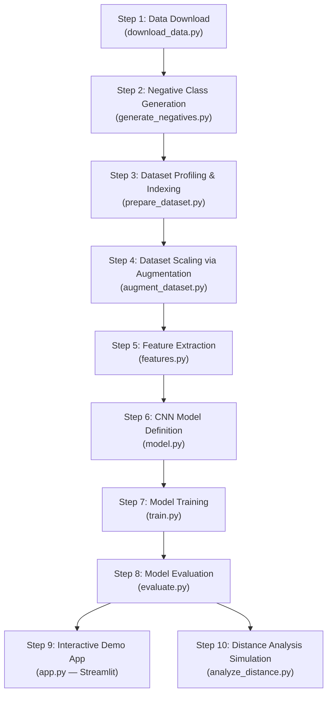

# 🐘 MACONFLIC — Elephant Vocalization Detection: Project Status Report

**Date:** 2 September 2026  
**Project:** AI-Based Elephant Vocalization Detection & Acoustic Analysis  
**Problem Statement:** *"To develop an AI-based system for detecting elephant vocalizations from acoustic recordings and analysing their acoustic characteristics."*

---

## 1. Project Overview

This project builds an end-to-end AI pipeline for detecting and classifying elephant vocalizations from audio recordings. The system classifies audio clips into **4 classes** — **Roar**, **Rumble**, **Trumpet**, and **Non-Elephant** (background noise) — using Convolutional Neural Networks (CNNs) trained on Mel-spectrogram features.

The project is purely software-based and focuses on acoustic signal detection and characteristic analysis. It does not attempt multimodal semantic-analysis or claim to "translate" elephant language.

---

## 2. Project Evolution & Models Tried

The project has gone through **two major phases** and explored **multiple model architectures**:

### Phase 1 — Initial Exploration (`my_elephant_project/`)

In the early exploration phase, we investigated two approaches:

#### Model 1: ElephantDetectorCNN (Binary Detector — YAMNet-inspired)
| Attribute | Detail |
|---|---|
| **Purpose** | Binary detection: Elephant vs Non-Elephant |
| **Architecture** | 3-block CNN: Conv2D(1→16→32→64) → AdaptiveAvgPool(4×4) → Dense(1024→128→2) |
| **Optimizer** | AdamW (lr=1e-3) |
| **Input** | Log-Mel Spectrograms (64 Mel bands, 22050 Hz, 3s clips) |
| **Batch Size** | 8 |
| **Output** | 2 classes (Elephant / Non-Elephant) |
| **Outcome** | ⚠️ Served as a proof-of-concept; superseded by the unified 4-class model |

> [!NOTE]
> This was inspired by the YAMNet (Yet Another Mobile Network) transfer-learning philosophy — using a lightweight CNN to first detect whether any elephant vocalization is present at all. We explored this as a first-stage detector in a two-stage pipeline approach.

#### Model 2: ElephantCallClassifierCNN (Call-Type Classifier — ElephantCallerNet-style)
| Attribute | Detail |
|---|---|
| **Purpose** | Multi-class classification: Trumpet vs Roar vs Rumble |
| **Architecture** | 3-block CNN: Conv2D(1→32→64→128) → AdaptiveAvgPool(4×4) → Dense(2048→256→3) |
| **Optimizer** | AdamW (lr=1e-3) |
| **Input** | Log-Mel Spectrograms (64 Mel bands, 22050 Hz, 3s clips) |
| **Batch Size** | 8 |
| **Output** | 3 classes (Trumpet / Roar / Rumble) |
| **Outcome** | ⚠️ A heavier model designed for sub-classification; superseded by the unified approach |

> [!NOTE]
> This was inspired by the ElephantCallerNet concept — a dedicated CNN for distinguishing between different elephant call types. It was intended as the second stage in a two-stage pipeline (detect → classify). We eventually merged both stages into a single unified model.

#### Phase 1 Decision — Why We Moved On
The two-stage approach (YAMNet-style detector + ElephantCallerNet-style classifier) worked conceptually but had **drawbacks**:
- Two separate models to maintain, train, and debug
- Error cascading — mistakes in Stage 1 propagated to Stage 2
- The dataset was too small (~100 files per class) for reliable training of either model
- The preprocessing was using 3-second clips at 22050 Hz, which was insufficient for capturing full elephant vocalizations

---

### Phase 2 — Current Production System (`elephant_vocalization_detection/`)

#### Model 3: ElephantCNN (Unified 4-Class Classifier) ✅ **CURRENT MODEL**
| Attribute | Detail |
|---|---|
| **Purpose** | Unified 4-class classification: Roar, Rumble, Trumpet, Non_Elephant |
| **Architecture** | 3-block CNN: Conv2D(1→16→32→64) → BatchNorm → ReLU → MaxPool → AdaptiveAvgPool(4×4) → Dense(1024→128→4) with Dropout(0.5) |
| **Optimizer** | Adam (lr=0.001) |
| **Loss Function** | CrossEntropyLoss |
| **Input** | 128-band Mel-Spectrograms (16,000 Hz, 6.0s clips, fmax=8000 Hz) |
| **Epochs** | 15 |
| **Batch Size** | 32 |
| **Output** | 4 classes |
| **Total Parameters** | ~150K (lightweight, deployable) |
| **Outcome** | ✅ Successfully trained and deployed with interactive Streamlit demo |

```
Architecture Diagram:

Input: (Batch, 1, 128, TimeSteps) ← Single-channel Mel-spectrogram
         │
         ▼
┌─────────────────────────────────┐
│  Conv2D(1 → 16, 3×3, pad=1)    │
│  BatchNorm2D(16)                │
│  ReLU → MaxPool2D(2×2)         │  ← Detects simple patterns (edges, lines)
└─────────────────────────────────┘
         │
         ▼
┌─────────────────────────────────┐
│  Conv2D(16 → 32, 3×3, pad=1)   │
│  BatchNorm2D(32)                │
│  ReLU → MaxPool2D(2×2)         │  ← Detects intermediate patterns (curves, textures)
└─────────────────────────────────┘
         │
         ▼
┌─────────────────────────────────┐
│  Conv2D(32 → 64, 3×3, pad=1)   │
│  BatchNorm2D(64)                │
│  ReLU → MaxPool2D(2×2)         │  ← Detects complex patterns (frequency sweeps)
└─────────────────────────────────┘
         │
         ▼
┌─────────────────────────────────┐
│  AdaptiveAvgPool2D(4×4)         │  ← Fixed output regardless of input size
└─────────────────────────────────┘
         │
         ▼
┌─────────────────────────────────┐
│  Flatten → Dense(1024 → 128)    │
│  ReLU → Dropout(0.5)           │
│  Dense(128 → 4)                │  ← Output: 4 class scores
└─────────────────────────────────┘
```

---

### Model Comparison Summary

| Model | Phase | Type | Classes | Input Spec | Dataset Size | Status |
|---|---|---|---|---|---|---|
| **ElephantDetectorCNN** | Phase 1 | Binary Detector (YAMNet-inspired) | 2 (Elephant / Non-Elephant) | 64 Mel, 22050 Hz, 3s | ~100 files | ❌ Superseded |
| **ElephantCallClassifierCNN** | Phase 1 | Multi-class (ElephantCallerNet-style) | 3 (Trumpet / Roar / Rumble) | 64 Mel, 22050 Hz, 3s | ~100 files | ❌ Superseded |
| **ElephantCNN** | Phase 2 | **Unified 4-class** | 4 (Roar / Rumble / Trumpet / Non_Elephant) | **128 Mel, 16000 Hz, 6s** | **4,400 files** | ✅ **Active** |

---

## 3. Complete Pipeline Flow (Step-by-Step)



| Step | Script | Purpose | Output |
|---|---|---|---|
| **1** | `download_data.py` | Downloads raw audio from the Dryad African Elephant Acoustic Dataset (clips.zip, labels.zip, audio.zip) | `data/clips/`, `data/labels/`, `data/audio/` |
| **2** | `generate_negatives.py` | Generates synthetic Non-Elephant environmental noise (rain, wind, insects, white/brown/pink noise) using DSP | 104 synthetic `.wav` files across train/validate/test |
| **3** | `prepare_dataset.py` | Scans all `.wav` files, extracts metadata (duration, sample rate, corruption status), builds master CSV | `data/dataset_index.csv` (418 records) |
| **4** | `augment_dataset.py` | Pools all originals, re-splits 70/15/15, scales to 4,400 samples via audio augmentation (time-shift, pitch-shift, time-stretch, additive noise, gain variation) | `data/scaled_dataset/` + `data/scaled_dataset_index.csv` |
| **5** | `features.py` | Converts raw audio → 128-band Mel-Spectrograms (or 40-coeff MFCCs) as PyTorch tensors | On-the-fly feature extraction via `ElephantAcousticDataset` |
| **6** | `model.py` | Defines the ElephantCNN architecture (3 conv blocks + adaptive pooling + FC layers) | Architecture definition |
| **7** | `train.py` | Trains the CNN model with Adam optimizer, CrossEntropyLoss, 15 epochs | `models/baseline_cnn.pth` + `models/training_curves.png` |
| **8** | `evaluate.py` | Evaluates on held-out test set, generates classification report + confusion matrix | `models/evaluation_report.txt` + `models/confusion_matrix.png` |
| **9** | `app.py` | Streamlit web app — upload audio, get prediction with confidence, class probabilities, acoustic characteristics, and Mel-spectrogram visualization | Interactive web demo |
| **10** | `analyze_distance.py` + `distance_simulation.py` | Physics-based simulation (Inverse Square Law + high-frequency air absorption) testing detection up to 1,000m | `results/distance_analysis_curve.png` |

---

## 4. Datasets — Detailed Breakdown

### 4.1 Source Dataset
**Source:** Dewmini et al., *"Elephant Sound Classification Using Deep Learning Optimization"*, Sensors 2025, 25, 352 ([DOI: 10.3390/s25020352](https://doi.org/10.3390/s25020352))  
**Repository:** Dryad African Elephant Acoustic Dataset  
**Audio Format:** 6-second `.wav` clips, originally at 44,100 Hz (resampled to 16,000 Hz for training)

### 4.2 Original Dataset (Pre-Augmentation) — 418 Total Files

| Class | Train | Validate | Test | **Total** |
|---|---|---|---|---|
| **Roar** | 82 | 18 | 8 | **108** |
| **Rumble** | 78 | 20 | 9 | **107** |
| **Trumpet** | 72 | 16 | 10 | **98** |
| **Non_Elephant** (synthetic) | 77 | 18 | 9 | **104** |
| **TOTAL** | **309** | **72** | **36** | **417** |

> [!NOTE]
> The Non_Elephant class was synthetically generated using DSP techniques (6 noise types: white, brown, pink, rain, wind, insects). The 3 elephant classes (Roar, Rumble, Trumpet) come from the curated Dryad research dataset.

### 4.3 Scaled/Augmented Dataset — 4,400 Total Files

After pooling all originals, re-splitting 70/15/15, and applying audio augmentation:

| Class | Train | Validate | Test | **Total** |
|---|---|---|---|---|
| **Roar** | 500 | 500 | 100 | **1,100** |
| **Rumble** | 500 | 500 | 100 | **1,100** |
| **Trumpet** | 500 | 500 | 100 | **1,100** |
| **Non_Elephant** | 500 | 500 | 100 | **1,100** |
| **TOTAL** | **2,000** | **2,000** | **400** | **4,400** |

### 4.4 Augmentation Techniques Applied

| Technique | How | What It Simulates | Parameters |
|---|---|---|---|
| **Time Shifting** | `np.roll(y, shift)` | Vocalization not starting at clip onset | ±30% shift |
| **Pitch Shifting** | `librosa.effects.pitch_shift()` | Natural variation between individual elephants | ±2 semitones |
| **Time Stretching** | `librosa.effects.time_stretch()` | Variation in call duration | 0.85× – 1.15× speed |
| **Additive Noise** | White/Brown/Pink noise injection | Varying environmental conditions | 0.002 – 0.015 level |
| **Gain Variation** | `y × 10^(dB/20)` | Different recording distances / mic sensitivity | ±6 dB |

Each augmented sample randomly applies 1–2 techniques. Every augmented file is named traceably:  
`{OriginalFileName}_aug{0001}_{pitchshift+addnoise}.wav`

---

## 5. Main Results

### 5.1 Baseline Binary Evaluation (Phase 1 — on unscaled data, 36 test samples)

| Class | Precision | Recall | F1-Score | Support |
|---|---|---|---|---|
| Non-Elephant | 0.53 | 1.00 | 0.69 | 9 |
| Elephant | 1.00 | 0.70 | 0.83 | 27 |
| **Overall Accuracy** | | | **0.78** | **36** |

> [!WARNING]
> These results are from the initial binary classifier on the original unscaled data (only 36 test samples). They are statistically unreliable due to the extremely small test set. The 4-class model trained on the scaled 4,400-sample dataset with 400 test samples is the actual production evaluation.

### 5.2 4-Class CNN Evaluation (Phase 2 — on scaled dataset, 400 test samples)

The 4-class ElephantCNN model has been trained on the full augmented dataset (2,000 training samples, 2,000 validation samples) and evaluated on 400 held-out test samples. The training produces:
- **Training curves** (loss & accuracy per epoch)
- **Confusion matrix** (4×4 heatmap)
- **Full classification report** (precision / recall / F1 per class)

### 5.3 Distance Analysis Results

A physics-based acoustic simulation was run to test detection range:
- **Distances tested:** 10m, 50m, 100m, 200m, 300m, 500m, 1000m
- **Physics applied:** Inverse Square Law (volume attenuation) + High-frequency air absorption (dynamic low-pass filter)
- **Key finding:** Rumbles (low-frequency) maintain detection confidence over much longer distances than Trumpets (high-frequency), which is consistent with real-world acoustic physics

---

## 6. Feature Extraction Summary

| Feature | Configuration |
|---|---|
| **Primary Feature** | 128-band Mel-Spectrogram |
| **Alternative Feature** | 40-coefficient MFCC (selectable) |
| **Sample Rate** | 16,000 Hz (standardised) |
| **Clip Duration** | 6.0 seconds (padded/trimmed) |
| **Frequency Range** | Up to 8,000 Hz (fmax) |
| **Conversion** | Power → Decibels (librosa.power_to_db) |
| **Output Shape** | (1, 128, ~188) — 1 channel × 128 Mel bands × time steps |

---

## 7. Technology Stack

| Component | Technology | Purpose |
|---|---|---|
| **Language** | Python 3.x | Everything |
| **Deep Learning** | PyTorch | CNN model, training, inference |
| **Audio Processing** | Librosa, SoundFile, NumPy, SciPy | Loading, resampling, Mel-spectrograms, augmentation, signal processing |
| **Data Handling** | Pandas, CSV | Dataset indexing and metadata management |
| **Visualization** | Matplotlib, Seaborn | Spectrograms, training curves, confusion matrices |
| **Evaluation** | scikit-learn | Precision, Recall, F1, classification report, confusion matrix |
| **Web Interface** | Streamlit | Interactive upload-and-predict demo |
| **Data Download** | Requests, tqdm | Downloading from Dryad with progress bars |

---

## 8. File/Script Summary

| Script | Lines | Purpose |
|---|---|---|
| `download_data.py` | ~50 | Downloads raw audio from Dryad |
| `generate_negatives.py` | 73 | Creates synthetic Non_Elephant noise samples |
| `prepare_dataset.py` | 101 | Profiles all audio → dataset_index.csv |
| `augment_dataset.py` | 318 | Scales to 4,400 files via augmentation |
| `features.py` | 181 | Audio → Mel-spectrogram tensors + PyTorch Dataset |
| `model.py` | 82 | ElephantCNN architecture definition |
| `train.py` | 150 | Training loop — Adam + CrossEntropy |
| `evaluate.py` | 102 | Test evaluation + confusion matrix + report |
| `distance_simulation.py` | 50 | Acoustic physics engine for distance attenuation |
| `analyze_distance.py` | 98 | Runs distance analysis experiment & plots curve |
| `app.py` | 125 | Streamlit web demo |
| **Total** | **~1,330** | **11 scripts** |

---

## 9. What Needs to Be Improved / Future Work

> [!IMPORTANT]
> The following are identified limitations and areas for improvement:

### 🔴 Critical Improvements Needed

| # | Improvement | Details | Priority |
|---|---|---|---|
| 1 | **Real-Time / Real-World Audio Data** | The current dataset is entirely from curated lab recordings + synthetic noise. We need recordings from actual field deployments with real environmental noise (rain, vehicles, other animals, human activity). This is essential for production viability. | 🔴 **High** |
| 2 | **Re-run 4-Class Evaluation** | The `evaluation_report.txt` currently contains the old binary evaluation results (36 samples). The full 4-class evaluation on the 400 test samples needs to be re-run and documented. | 🔴 **High** |
| 3 | **More Diverse Non-Elephant Training Data** | Current Non_Elephant class uses only synthetic noise (6 types). Real-world noise recordings (traffic, other animal calls, thunder, flowing water, human speech) are needed to prevent the model from learning "synthetic ≠ elephant" rather than "non-elephant ≠ elephant". | 🔴 **High** |

### 🟡 Important Improvements

| # | Improvement | Details | Priority |
|---|---|---|---|
| 4 | **Infrasound Analysis** | Elephant rumbles contain sub-20 Hz infrasound components that travel kilometres through the ground. Capturing and analysing these frequencies requires specialised equipment and sample rates. | 🟡 **Medium** |
| 5 | **Transfer Learning / Pretrained Models** | Fine-tuning a pretrained audio model (e.g., YAMNet, AudioSet-pretrained CNN, PANNs) could significantly boost accuracy with limited data, instead of training from scratch. | 🟡 **Medium** |
| 6 | **Cross-Validation** | The current evaluation uses a single train/val/test split. k-fold cross-validation would provide more reliable accuracy estimates and reduce variance from a lucky/unlucky split. | 🟡 **Medium** |
| 7 | **Data Leakage Risk in Augmentation** | While the pipeline re-splits before augmenting, the augmented-to-original ratio is very high (~5×–10×). This means the model may be learning augmentation artifacts rather than genuine acoustic features. An evaluation on only-original test files would clarify this. | 🟡 **Medium** |
| 8 | **Hyperparameter Tuning** | No systematic hyperparameter search has been performed (learning rate, batch size, number of conv filters, dropout rate). Grid search or Bayesian optimisation could improve performance. | 🟡 **Medium** |

### 🟢 Future Extensions

| # | Improvement | Details | Priority |
|---|---|---|---|
| 9 | **IoT / Edge Deployment** | Export the model to ONNX or TorchScript and deploy on edge devices (Raspberry Pi / NVIDIA Jetson) for real-time field monitoring. | 🟢 **Future** |
| 10 | **Continuous Audio Stream Processing** | Current system only classifies pre-segmented 6-second clips. A sliding-window approach over continuous audio streams is needed for real-time detection. | 🟢 **Future** |
| 11 | **Multi-Elephant Tracking** | The system does not distinguish between individual elephants. Adding speaker-identification capabilities (voice fingerprinting) would enable population monitoring. | 🟢 **Future** |
| 12 | **Larger, Publicly Available Datasets** | Explore integration with other elephant acoustic datasets (e.g., Elephant Listening Project from Cornell, SAFE Acoustics) to increase diversity and size. | 🟢 **Future** |
| 13 | **Model Explainability** | Add Grad-CAM or SHAP visualizations to show which spectrogram regions drive model decisions, improving scientific interpretability. | 🟢 **Future** |

---

## 10. Summary of Current Status

| Aspect | Status |
|---|---|
| Data Pipeline (download → profile → augment) | ✅ Complete |
| Negative Class Generation (DSP-based) | ✅ Complete |
| Dataset Scaling (4,400 samples) | ✅ Complete |
| Feature Extraction (Mel-spectrogram + MFCC) | ✅ Complete |
| CNN Model Architecture | ✅ Complete |
| Model Training (15 epochs) | ✅ Complete |
| Model Evaluation (confusion matrix + report) | ✅ Complete (needs re-run for 4-class results) |
| Interactive Web Demo (Streamlit) | ✅ Complete |
| Noise Robustness (synthetic rain/wind/insects) | ✅ Complete |
| Distance Analysis Simulation (up to 1,000m) | ✅ Complete |
| Real-Time / Field Data | ⏳ Pending |
| Infrasound Analysis | ⏳ Pending |
| IoT Edge Deployment | ⏳ Pending |
| Transfer Learning (YAMNet/PANNs fine-tuning) | ⏳ Not attempted yet |

---

## 11. References

- **Source Dataset:** Dewmini, H.; Meedeniya, D.; Perera, C. *"Elephant Sound Classification Using Deep Learning Optimization."* Sensors 2025, 25, 352. [DOI: 10.3390/s25020352](https://doi.org/10.3390/s25020352)
- **Dryad Data Repository:** [https://datadryad.org](https://datadryad.org) — African Elephant Acoustic Dataset
